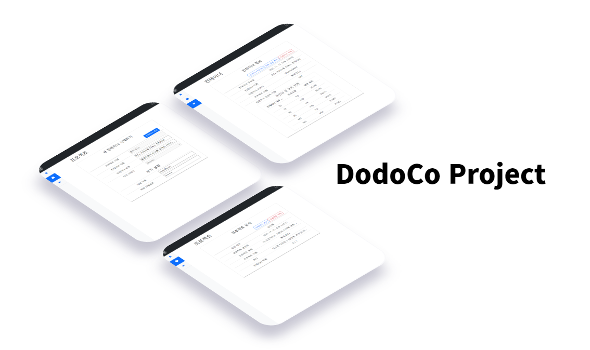

# DodoCo

## Docker Deployment & Operation Controller
  DodoCo is a project to manage docker container as project units.  

  * User can generate projects.  
  * Managers can approve projects and allocate container slots.  
  * The user can then create a docker container in that slot.  

  This is an experimental project. There are not many things that work well yet and there are so many things to do.
